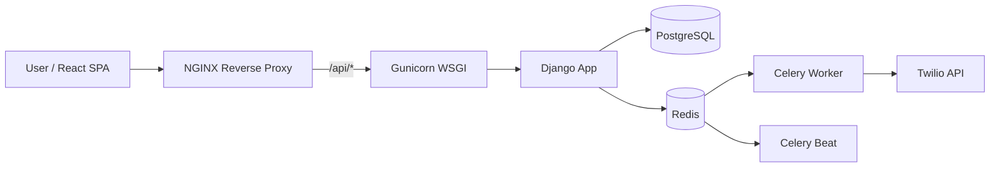

# Production Deployment Guide

## 1. Prerequisites
- Docker & Docker Compose (or Podman)
- PostgreSQL Database
- Redis Instance (for Celery)
- NGINX as reverse proxy
- Gunicorn (WSGI Server for Django)

## 2. Environment Variables (`.env`)
Create a `.env` file in the root directory:
```
DJANGO_SECRET_KEY=your_production_secret
DEBUG=False
ALLOWED_HOSTS=api.yourdomain.com,yourdomain.com
DATABASE_URL=postgres://tracker_user:tracker_password@db:5432/tracker_db
CELERY_BROKER_URL=redis://redis:6379/0
TWILIO_ACCOUNT_SID=your_twilio_sid
TWILIO_AUTH_TOKEN=your_twilio_token
TWILIO_FROM_NUMBER=+1234567890
```

## 3. Production Deployment Architecture



## 4. Steps to Deploy
1. **Frontend Build:** Navigate to `frontend/` and run `npm run build`. Serve the generated `dist/` directory statically via NGINX.
2. **Backend Services:** Deploy the backend using Docker Compose. A production `docker-compose.prod.yml` should include:
   - `web`: Gunicorn server (`gunicorn config.wsgi:application --bind 0.0.0.0:8000`)
   - `worker`: Celery worker (`celery -A config worker -l info`)
   - `beat`: Celery beat (`celery -A config beat -l info`)
3. **Database Migrations:** Run `python manage.py migrate` against the production database.
4. **Static Files:** Run `python manage.py collectstatic` so NGINX can serve the Django Admin and DRF assets.

## 5. Backup & Monitoring Strategy
- **Backup:** Schedule a daily `pg_dump` via cron, backing up to an off-site AWS S3 bucket.
- **Monitoring:** Utilize Sentry (for Python error tracking) and Datadog (for monitoring server/Celery resource usage).
